# FLOWCHART SISTEM - MERMAID CODE

## Petunjuk Penggunaan:
1. Copy code mermaid di bawah
2. Paste ke editor yang support mermaid (GitHub, Notion, Obsidian, atau mermaid.live)
3. Atau gunakan plugin mermaid di VS Code/Word
4. Render otomatis menjadi diagram visual

---

## 1. PLANT BOARD - MAIN SYSTEM FLOW


---

## 2. DC MOTOR CONTROL WITH PID (DETAILED)


---

## 3. AC MOTOR CONTROL WITH PID & KALMAN FILTER

```mermaid
flowchart TD
    Timer[Timer Interrupt<br/>Variable Interval] --> SetFlag[Set ACnewDataReady = TRUE]
    SetFlag --> CheckRequest{acspeedRequest?}
    
    CheckRequest -->|FALSE| MotorOff[Motor OFF<br/>PWM = 0<br/>Reset Integral]
    MotorOff --> EndLoop([Return to Loop])
    
    CheckRequest -->|TRUE| ReadRaw[Read Raw Encoder Pulses]
    ReadRaw --> Kalman[Apply Kalman Filter]
    
    Kalman --> Predict[Prediction Step<br/>estimate = prev_estimate<br/>error_est += process_noise]
    Predict --> Update[Update Step<br/>kalman_gain = error_est / error_est + measure_noise<br/>estimate += gain × measurement - estimate]
    Update --> FilterOut[Filtered RPM<br/>ACrpm = estimate]
    
    FilterOut --> CheckMode{Mode?}
    
    CheckMode -->|PID Mode| CalcError[Calculate Error<br/>Error = Setpoint - ACrpm]
    CalcError --> Proportional[Proportional Term<br/>P = Kp × Error]
    Proportional --> Integral[Integral Term<br/>with Anti-Windup<br/>I = Ki × integralSum]
    Integral --> Derivative[Derivative Term<br/>D = Kd × dError/dt]
    Derivative --> SumPID[Total Output<br/>output = P + I + D]
    SumPID --> Saturate{Saturation Check}
    
    Saturate -->|> 255| SetMax[output = 255]
    Saturate -->|< 0| SetMin[output = 0]
    Saturate -->|0 to 800| AntiStall[output = 800<br/>Anti-Stall]
    Saturate -->|OK| KeepOut[Keep output]
    
    SetMax --> SendPWM[Send PWM to Motor<br/>ACmotorControl]
    SetMin --> SendPWM
    AntiStall --> SendPWM
    KeepOut --> SendPWM
    
    CheckMode -->|Manual Mode| ManualPWM[PWM = map<br/>setpoint: 0-1500 → 0-255]
    ManualPWM --> SendPWM
    
    CheckMode -->|Motor OFF| MotorOff
    
    SendPWM --> SendFeedback[Send Feedback via ESP-NOW<br/>MSG_AC_SPEED, ACrpm<br/>MSG_TIMESTAMP, millis]
    SendFeedback --> ClearFlag[Clear ACnewDataReady]
    ClearFlag --> EndLoop
    
    style Timer fill:#ff5722,stroke:#d84315,color:#fff
    style Kalman fill:#00bcd4,stroke:#0097a7,color:#fff
    style Predict fill:#00acc1,stroke:#006064,color:#fff
    style Update fill:#00acc1,stroke:#006064,color:#fff
    style SendPWM fill:#4caf50,stroke:#2e7d32,color:#fff
```



---

## 4. INTERFACE BOARD - MAIN SYSTEM FLOW


---

## 5. MENU NAVIGATION SYSTEM (STATE MACHINE)


---

## 6. ESP-NOW COMMUNICATION FLOW (SEQUENCE)


---

## 7. DATA FLOW - COMMAND (USER → MOTOR)


---

## 8. DATA FLOW - FEEDBACK (MOTOR → DISPLAY)


---

## 9. ENCODER INTERRUPT HANDLER


---

## 10. EEPROM DATA STORAGE FLOW


---

## 11. GRAPH DISPLAY UPDATE (OSCILLOSCOPE STYLE)

```mermaid
flowchart TD
    Start([New Speed Data Arrived]) --> Callback[receiveData Callback<br/>MSG_DC_SPEED or MSG_AC_SPEED]
    Callback --> ParseValue[Extract RPM Value<br/>float rpm]
    ParseValue --> UpdateGlobal[Update Global Variable<br/>g_escSpeed = rpm]
    UpdateGlobal --> AddBuffer[Add to Circular Buffer<br/>history index++ % 100]
    AddBuffer --> SetFlag[Set Update Flag<br/>g_escSpeedUpdated = TRUE]
    SetFlag --> WaitMain([Wait for Main Loop])
    
    WaitMain --> MainLoop[menuUpdate Called<br/>in Main Loop]
    MainLoop --> CheckFlag{Update Flag<br/>TRUE?}
    
    CheckFlag -->|FALSE| SkipUpdate([Skip Update])
    CheckFlag -->|TRUE| CheckMode{Full Redraw<br/>or Incremental?}
    
    CheckMode -->|Full Redraw| ClearArea[Clear Graph Area<br/>118x70 pixels]
    ClearArea --> DrawBorder[Draw Border<br/>White Rectangle]
    DrawBorder --> DrawSetpoint[Draw Setpoint Line<br/>Red Dashed Horizontal]
    DrawSetpoint --> DrawGrid[Draw Time Grid<br/>Cyan Vertical Lines per 1s]
    DrawGrid --> PlotAll[Plot All Historical Data<br/>Loop through 100 samples]
    
    PlotAll --> LoopSamples[For col = 0 to 115]
    LoopSamples --> Interpolate[Interpolate Buffer Index<br/>idx = historyIndex - offset % 100]
    Interpolate --> GetValue[value = history idx]
    GetValue --> CalcY[Calculate Y Coordinate<br/>y = 94 - value × 69 / MAX]
    CalcY --> ClampY[Clamp Y to 25-94 range]
    ClampY --> DrawPixel[Draw Pixel x, y<br/>Yellow Color]
    DrawPixel --> SaveY[Save Y to escGraphY col]
    SaveY --> NextCol{More<br/>Columns?}
    NextCol -->|YES| LoopSamples
    NextCol -->|NO| SetInit[escGraphInit = TRUE]
    
    CheckMode -->|Incremental| ShiftLoop[For col = 0 to 114]
    ShiftLoop --> EraseOld[Erase Old Pixel<br/>Draw x, escGraphY col BLACK]
    EraseOld --> DrawNew[Draw New Pixel<br/>Draw x, escGraphY col+1 YELLOW]
    DrawNew --> UpdateBuffer[escGraphY col = escGraphY col+1]
    UpdateBuffer --> NextShift{More to Shift?}
    NextShift -->|YES| ShiftLoop
    NextShift -->|NO| DrawNewest[Draw Newest Data<br/>Rightmost Column]
    
    DrawNewest --> GetLatest[value = history lastIndex]
    GetLatest --> CalcYNew[Calculate Y<br/>Scale to Pixel]
    CalcYNew --> DrawRight[Draw Pixel<br/>rightX, y YELLOW]
    DrawRight --> SaveRight[escGraphY 115 = y]
    
    SetInit --> ClearFlag[Clear Update Flag<br/>g_escSpeedUpdated = FALSE]
    SaveRight --> ClearFlag
    ClearFlag --> Done([Graph Updated<br/>User Sees Result])
    
    style Callback fill:#ff5722,stroke:#d84315,color:#fff
    style AddBuffer fill:#1976d2,stroke:#0d47a1,color:#fff
    style SetFlag fill:#ff9800,stroke:#e65100,color:#fff
    style DrawPixel fill:#9c27b0,stroke:#6a1b9a,color:#fff
    style DrawNew fill:#9c27b0,stroke:#6a1b9a,color:#fff
    style Done fill:#4caf50,stroke:#2e7d32,color:#fff
```



---

## 12. COMPLETE SYSTEM INTERACTION

```mermaid
graph TB
    subgraph User["👤 USER"]
        U1[Rotary Encoder<br/>Rotate & Click]
    end
    
    subgraph Interface["📱 INTERFACE BOARD (ESP8266)"]
        I1[Input Handler<br/>Encoder + Button]
        I2[Menu System<br/>Navigation & Edit]
        I3[TFT Display<br/>ST7735 128x160]
        I4[Graph Engine<br/>Real-time Plot]
        I5[ESP-NOW TX/RX<br/>WiFi 2.4GHz]
    end
    
    subgraph Wireless["📡 WIRELESS COMMUNICATION"]
        W1[ESP-NOW Protocol<br/>Peer-to-Peer<br/>Low Latency]
    end
    
    subgraph Plant["🎛️ PLANT BOARD (ESP32)"]
        P1[ESP-NOW TX/RX<br/>WiFi 2.4GHz]
        P2[Data Storage<br/>EEPROM<br/>PID Parameters]
        P3[DC Motor Controller<br/>Timer + PID]
        P4[AC Motor Controller<br/>Timer + PID + Kalman]
        P5[LED Indicators<br/>Status Display]
    end
    
    subgraph Motors["⚙️ MOTORS & SENSORS"]
        M1[DC Motor<br/>Escalator<br/>+ Rotary Encoder]
        M2[AC Motor<br/>Conveyor<br/>+ Rotary Encoder]
    end
    
    U1 <-->|User Interaction| I1
    I1 --> I2
    I2 --> I3
    I2 --> I4
    I3 --> U1
    I4 --> I3
    I2 <--> I5
    
    I5 <-->|Commands<br/>MSG_DC_Setpoint<br/>MSG_AC_Setpoint<br/>MSG_PID_MODE<br/>etc.| W1
    
    W1 <-->|Feedback<br/>MSG_DC_SPEED<br/>MSG_AC_SPEED<br/>MSG_TIMESTAMP| P1
    
    P1 --> P2
    P1 --> P3
    P1 --> P4
    P2 -.->|Load/Save| P3
    P2 -.->|Load/Save| P4
    P3 --> P5
    P4 --> P5
    
    P3 <-->|PWM Control<br/>Encoder Feedback| M1
    P4 <-->|PWM Control<br/>Encoder Feedback| M2
    
    style U1 fill:#4caf50,stroke:#2e7d32,color:#fff
    style I3 fill:#2196f3,stroke:#0d47a1,color:#fff
    style I4 fill:#9c27b0,stroke:#6a1b9a,color:#fff
    style W1 fill:#ff9800,stroke:#e65100,color:#fff
    style P2 fill:#795548,stroke:#4e342e,color:#fff
    style P3 fill:#f44336,stroke:#c62828,color:#fff
    style P4 fill:#f44336,stroke:#c62828,color:#fff
    style M1 fill:#607d8b,stroke:#37474f,color:#fff
    style M2 fill:#607d8b,stroke:#37474f,color:#fff
```



---

## CARA MENGGUNAKAN MERMAID CODE:

### **Option 1: GitHub / GitLab**
1. Copy code mermaid (termasuk ``` mermaid dan ```)
2. Paste langsung ke file `.md` di GitHub
3. Push ke repository
4. GitHub auto-render jadi diagram

### **Option 2: Mermaid Live Editor**
1. Buka https://mermaid.live
2. Paste code mermaid (tanpa ``` mermaid, hanya isinya)
3. Preview real-time di kanan
4. Export sebagai PNG/SVG/PDF

### **Option 3: VS Code**
1. Install extension: **Markdown Preview Mermaid Support**
2. Buka file `.md` dengan mermaid code
3. Klik **Preview** (Ctrl+Shift+V)
4. Diagram muncul di preview

### **Option 4: Notion**
1. Type `/code`
2. Pilih **Mermaid**
3. Paste mermaid code
4. Auto-render jadi diagram

### **Option 5: Obsidian**
1. Obsidian sudah support mermaid by default
2. Paste code dengan ``` mermaid wrapper
3. Preview mode akan render diagram

### **Option 6: Word (dengan Plugin)**
1. Install plugin: **Mermaid for Word** atau **Markdown to Word**
2. Atau: Render di mermaid.live → export PNG → insert ke Word

---

## LEGEND WARNA:

- 🟢 **Hijau** = Start/End, Success, Ready
- 🔵 **Biru** = Process, Normal Operation
- 🟣 **Ungu** = PID Calculation, Critical Section
- 🟠 **Orange** = Loop, Main Flow, Warning
- 🔴 **Merah** = Interrupt, Timer, Motor Control
- 🔷 **Cyan** = Kalman Filter, Data Processing
- ⚫ **Abu-abu** = Hardware, Physical Component

---

## TIPS CUSTOMIZATION:

### **Ubah Warna Shape:**
```
style NodeName fill:#hexcolor,stroke:#hexcolor,color:#textcolor
```

### **Tambah Icon/Emoji:**
```
Node[🚀 Text dengan Icon]
```

### **Ubah Jenis Arrow:**
- `-->` = Solid arrow
- `-.->` = Dotted arrow
- `==>` = Thick arrow
- `<-->` = Bidirectional

### **Subgraph untuk Grouping:**
```mermaid
subgraph Title
    Node1 --> Node2
end
```

Selamat menggunakan Mermaid! 🎨📊
